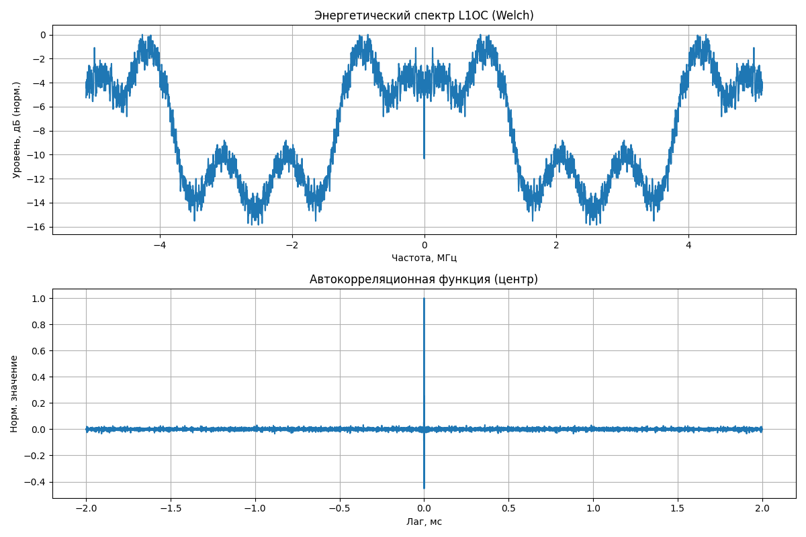

# GLONASS L1OC Signal Simulator

Проект для моделирования радионавигационного сигнала L1OC системы ГЛОНАСС на промежуточной частоте с учётом TDM-уплотнения двух компонент (данные и пилот), модуляции навигационного и оверлейного кодов.  

Сигнал анализируется с помощью расчёта энергетического спектра (PSD) и автокорреляционной функции (АКФ).





---

## Требования

- Docker >= 20.10
- Docker Compose >= 1.29
- Python 3.10 (устанавливается в контейнере)

---

## Сборка и запуск

### 1. Сборка образа

```bash
### 1. Cборка и запуск контейнера через Docker
docker-compose -f .\docker-compose.yaml up --build

### 2. Запуск без Docker
main.py